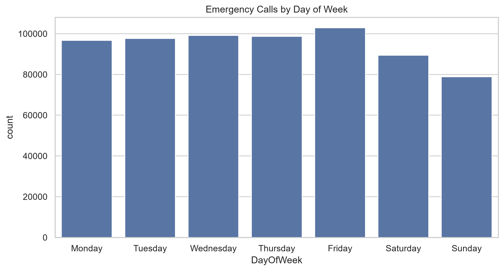
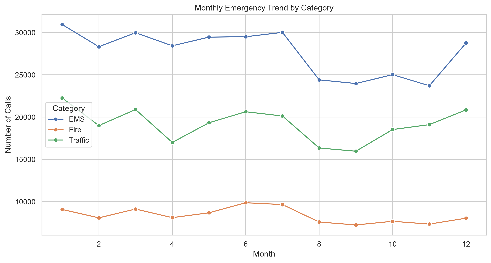
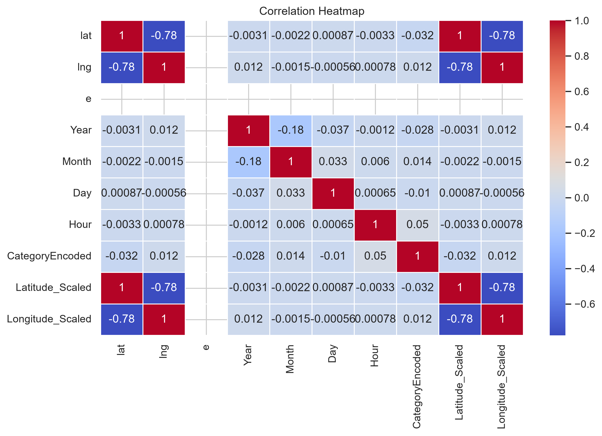
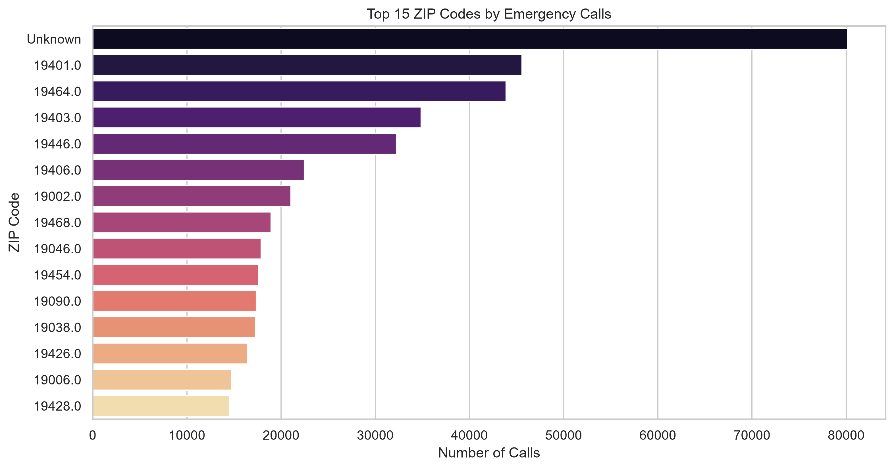

# 🚑 Emergency Response Intelligence

> **An End-to-End Data Analytics Project on Montgomery County 911 Emergency Calls**


---

## 📌 Project Overview

Emergency response systems receive thousands of emergency calls every day. Understanding patterns in these calls enables emergency service providers to improve resource allocation, staffing, and operational planning.


This project demonstrates a complete **end-to-end data analytics workflow** using the Montgomery County 911 Emergency Calls dataset. Starting from raw data, the project applies professional data preparation techniques, performs exploratory data analysis, engineers new features, and generates actionable business insights.

---

## 🎯 Project Objectives

* Understand the dataset structure and quality
* Clean and preprocess real-world emergency response data
* Perform exploratory data analysis (EDA)
* Engineer meaningful analytical features
* Generate business insights for emergency response planning
* Build a portfolio-ready data analytics project

---

## 📂 Dataset

**Dataset:** Montgomery County 911 Emergency Calls

**Source:** Kaggle

The raw dataset is **not included** in this repository because it exceeds GitHub's file size limit.

Download the dataset from Kaggle and place it in:

```text
data/raw/911.csv
```

---

## 📁 Project Structure

```text
Emergency-Response-Intelligence/
│
├── data/
│   ├── raw/
│   ├── interim/
│   └── processed/
│
├── notebooks/
│   ├── 01_Data_Understanding.ipynb
│   ├── 02_Data_Cleaning.ipynb
│   ├── 03_Data_Preprocessing.ipynb
│   ├── 04_Exploratory_Data_Analysis.ipynb
│   ├── 05_Feature_Engineering.ipynb
│   └── 06_Final_Report.ipynb
│
├── outputs/
│   ├── figures/
│   ├── reports/
│   └── tables/
│
├── src/
├── README.md
├── requirements.txt
├── LICENSE
└── .gitignore
```

---

# 🔄 Project Workflow

```text
Raw Dataset
      │
      ▼
Data Understanding
      │
      ▼
Data Cleaning
      │
      ▼
Data Preprocessing
      │
      ▼
Exploratory Data Analysis
      │
      ▼
Feature Engineering
      │
      ▼
Business Insights
      │
      ▼
Final Dataset
```

---

# 🧹 Data Preparation Techniques Applied

* Missing Value Analysis
* Missing Value Treatment
* Duplicate Detection
* Duplicate Removal
* Data Type Conversion
* Datetime Conversion
* Text Cleaning
* Whitespace Removal
* Feature Extraction
* Label Encoding
* Feature Scaling
* Dataset Validation

---

# 📊 Exploratory Data Analysis

The project answers several business questions, including:

* Which emergency category occurs most frequently?
* Which townships receive the highest number of emergency calls?
* Which ZIP codes generate the most incidents?
* What are the busiest hours for emergency services?
* Which weekdays experience the highest demand?
* Are there seasonal patterns in emergency calls?
* Which locations require additional emergency resources?

  ## 📊 Sample Visualizations

### Emergency Category Distribution



---

### Monthly Emergency Trend



---

### Correlation Heatmap



---

### Top ZIP Codes



---

# ⚙️ Feature Engineering

New features created include:

* Year
* Month
* Day
* Hour
* Day of Week
* Weekend Indicator
* Time of Day
* Emergency Category
* Peak Hour
* Rush Hour
* Business Hours
* Night Emergency
* Season
* Quarter
* Priority Score
* Call Density
* High Demand Township
* High Demand ZIP Code

---

# 📈 Key Business Insights

* EMS incidents account for the largest proportion of emergency calls.
* Emergency demand peaks during daytime and evening hours.
* A limited number of townships generate a significant share of emergency calls.
* Certain ZIP codes consistently report higher emergency activity.
* Weekly and monthly trends can support workforce planning and resource allocation.

---

# 💡 Recommendations

* Increase staffing during peak emergency hours.
* Deploy additional ambulances to high-demand locations.
* Use historical trends for predictive resource planning.
* Develop real-time emergency monitoring dashboards.
* Expand future analysis with weather and traffic data.

---

# 🛠 Technologies Used

| Category         | Tools               |
| ---------------- | ------------------- |
| Programming      | Python              |
| Data Analysis    | Pandas, NumPy       |
| Visualization    | Matplotlib, Seaborn |
| Machine Learning | Scikit-learn        |
| Development      | Jupyter Notebook    |
| Version Control  | Git, GitHub         |

---

# 🚀 Installation

Clone the repository:

```bash
git clone <repository-url>
```

Navigate to the project folder:

```bash
cd Emergency-Response-Intelligence
```

Install dependencies:

```bash
pip install -r requirements.txt
```

Launch Jupyter Notebook:

```bash
jupyter notebook
```

---

# 📌 Future Enhancements

* Interactive Power BI Dashboard
* Tableau Dashboard
* Predictive Machine Learning Models
* Geographic Heatmaps
* Real-Time Emergency Monitoring
* API Integration
* Streamlit Web Application

---

# 👩‍💻 Author

**Ramya Ramadoss**

B.Tech Computer Science Engineering
VIT Chennai

---

## ⭐ If you found this project helpful, consider giving it a star on GitHub!
